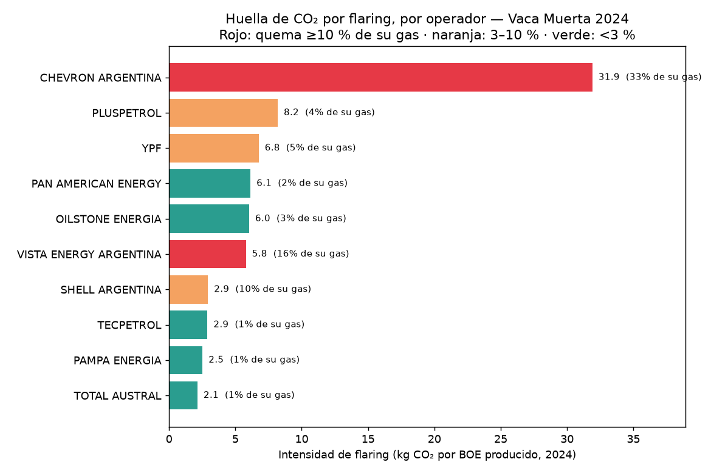

# Flaring → CO₂ por operador (resultado)

Primer numerador satelital del proyecto: el **CO₂ por quema de gas en antorcha** (*flaring*),
atribuido a cada operador. Es el camino **más sólido** porque las antorchas son **infraestructura fija
y geolocalizada** (ver [Metodología](metodologia.md)).

## El número

En **2024**, sobre el área de Vaca Muerta, **VIIRS Nightfire** detectó **113 antorchas** que quemaron
**~1.196 millones de m³ de gas** (1,2 BCM) — alrededor del **3 % del gas producido en la cuenca**. Eso
equivale a **~2,4 millones de toneladas de CO₂** en un año, solo por flaring. El **94 % del volumen** se
pudo asignar a una concesión y su operador.

<iframe src="../assets/flaring_mapa.html" width="100%" height="540" style="border:1px solid #ccc;border-radius:6px"></iframe>

*Cada círculo es una antorcha; el tamaño es proporcional al volumen quemado y el color, al operador.
Pasá el mouse para ver concesión, volumen y CO₂. Fuente: VIIRS Nightfire (Earth Observation Group),
sobre las concesiones de la cuenca.*

## La huella por barril: gasíferos vs petroleros

Acá está lo interesante. Dividiendo el CO₂ de flaring de cada operador por su **producción 2024 (BOE)**
aparece un patrón nítido:

{ loading=lazy }

> Los operadores **gasíferos** (Tecpetrol, Pampa, Total) queman **~1 % de su gas** → intensidad baja
> (~2–3 kg CO₂/BOE): el gas es su producto, no lo desperdician. Los **petroleros** queman el **gas
> asociado** que no pueden evacuar: **Vista** quema el 16 % de su gas y **Chevron** el **33 %**, que a
> su escala de producción se traduce en **~32 kg CO₂/BOE** — más de **10×** la intensidad de un
> gasífero. La huella de CO₂ por barril **no se reparte parejo**.

| Operador | Antorchas | Gas quemado (Mm³) | % de su gas | CO₂ (kt) | kg CO₂/BOE |
|---|---:|---:|---:|---:|---:|
| YPF | 46 | 551 | 4,9 % | 1.101 | 6,8 |
| Pluspetrol | 4 | 125 | 4,2 % | 250 | 8,2 |
| Pan American Energy | 8 | 95 | 2,5 % | 189 | 6,1 |
| Vista Energy | 7 | 72 | **16,4 %** | 143 | 5,8 |
| Chevron | 6 | 64 | **33,3 %** | 128 | **31,9** |
| Tecpetrol | 6 | 60 | 1,0 % | 120 | 2,9 |
| Pampa Energía | 5 | 35 | 0,8 % | 70 | 2,5 |
| Total Austral | 2 | 35 | 0,7 % | 69 | 2,1 |

*YPF domina el CO₂ **absoluto** (es el mayor productor), pero su **intensidad** (6,8 kg CO₂/BOE) es
media. La intensidad alta es de los operadores **petroleros** con mucho gas asociado quemado.*

!!! warning "Límites de este resultado (honestidad)"
    - **Solo flaring**, no fugas/venteo de metano (eso es la [Fase 2 de metano](proximos-pasos.md)).
    - **Factor de conversión:** uso **2,0 kg CO₂/m³** de gas quemado; el real depende de la composición
      (~1,9–2,4) y de la eficiencia de combustión (el CH₄ no quemado, *slip*, suma CO₂e aparte).
    - **Atribución:** 94 % del volumen cae en una concesión; el resto (~6 %) queda "sin asignar". Unos
      pocos operadores chicos no cruzan por diferencia de nombre entre la concesión y el registro de
      producción → su intensidad queda en blanco.
    - **Año:** 2024 (último año completo común a flaring y producción). La [producción](produccion.md)
      general del sitio se muestra para 2025.
    - **VIIRS** detecta antorchas activas y calientes; quemas chicas o intermitentes pueden no aparecer.

> Reproducible: `python docs/pipeline/flaring_operador.py` (descarga VIIRS Nightfire + producción Cap IV
> 2024 y cruza con las concesiones) y `flaring_visuals.py`. Datos en
> `docs/data/flaring_por_operador.csv`.
