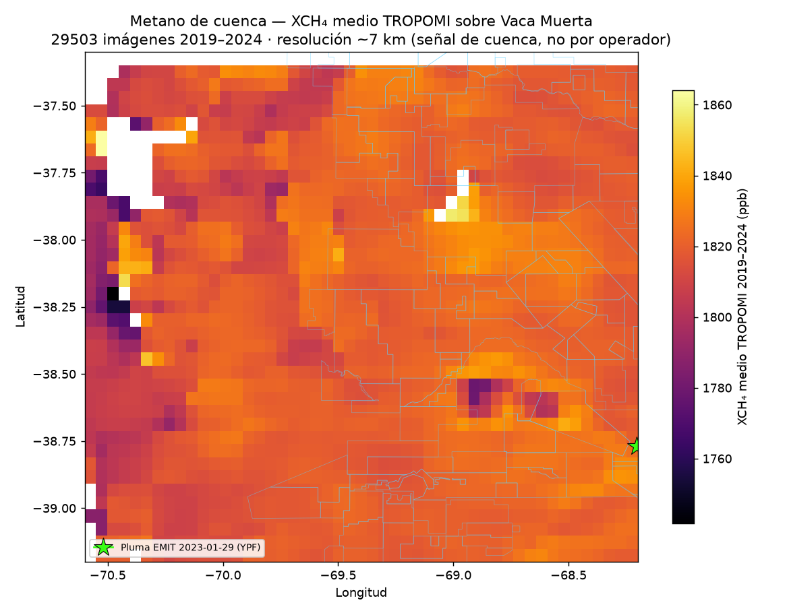

# Metano: la capa de contexto (cuenca)

El [flaring → CO₂](flaring.md) se atribuye a cada operador porque las antorchas son **puntos fijos y
geolocalizados**. El **metano (CH₄)** —fugas y venteos— es lo más relevante para el clima pero lo
**menos atribuible** desde el espacio: o se lo ve a **escala de cuenca** (TROPOMI, ~7 km) o como
**plumas puntuales** que solo aparecen si la fuente supera un umbral grande (EMIT, 60 m). Ninguna de las
dos reparte el metano por operador.

Por eso esta página es **contexto honesto**, no un numerador por empresa. Mostramos dos cosas: dónde
aparece Vaca Muerta en el mapa de metano de cuenca, y qué dice EMIT punto por punto (que observó la zona
**132 veces** y catalogó **una sola pluma** → pocas fuentes puntuales grandes).

!!! info "Por qué *no* hacemos la “intensidad de metano por operador”"
    La idea original (Fase 2) era una **inversión por clúster** de TROPOMI con viento ERA5-Land para
    sacar flujos por sub-área. La descartamos: a ~7 km de resolución, con error de **±40 %** y
    concesiones solapadas, el resultado no distingue operadores y daría una falsa precisión. El número
    **robusto** de intensidad de metano de la región ya existe y es de terceros:
    [Hancock et al. 2025](antecedentes.md) lo estima en **~5,9 % para Argentina**, atribuido a la
    expansión de Neuquén.

## 1. Metano de cuenca — XCH₄ medio de TROPOMI

Promediando **29.503 imágenes de Sentinel-5P / TROPOMI (2019–2024)** sobre el área de Vaca Muerta se ve
el campo de **XCH₄** (columna de metano, en ppb) de la cuenca:

<iframe src="../assets/metano_mapa.html" width="100%" height="540" style="border:1px solid #ccc;border-radius:6px"></iframe>

*Overlay: XCH₄ medio TROPOMI 2019–2024 (más claro = más metano). Encima, las concesiones y la pluma de
EMIT. Activá/desactivá capas arriba a la derecha. Fuente: `COPERNICUS/S5P/OFFL/L3_CH4` vía Google Earth
Engine.*

{ loading=lazy }

Sobre el AOI el XCH₄ medio va de **~1.740 a ~1.860 ppb**, con un realce sobre la franja productiva
central-este. Pero ese contraste hay que leerlo con cuidado:

!!! warning "Cómo (no) leer este mapa"
    - **Es señal de cuenca, no de operador.** Un píxel de ~7 km mezcla muchas concesiones.
    - **El valor absoluto no “prueba” un hotspot por sí solo.** El XCH₄ de TROPOMI tiene sesgos por
      terreno, albedo y ángulo solar; la variación intra-cuenca incluye artefactos de retrieval.
    - **El número robusto es de la inversión de [Hancock et al. 2025](antecedentes.md)** (~5,9 % de
      intensidad de metano para Argentina, atribuida a la expansión de Neuquén): eso sí es un resultado
      científico atribuido, y es el ancla de contexto de esta capa.

## 2. Las plumas puntuales — NASA EMIT

EMIT (espectrómetro de imágenes en la ISS) detecta **plumas individuales de metano a 60 m**. Y, contra lo
que podría suponerse, **observó Vaca Muerta muchas veces**: el producto de realce de CH₄ por escena
([`EMITL2BCH4ENH`](https://www.earthdata.nasa.gov/data/catalog/lpcloud-emitl2bch4enh-002), vía el CMR de
Earthdata) tiene **421 escenas en 132 fechas distintas entre 2022 y 2026** sobre el AOI — del orden de
**30–40 pasadas por año**. La cobertura es buena, no esporádica.

A pesar de esa cobertura, el catálogo curado de plumas
([`EMITL2BCH4PLM`](https://www.earthdata.nasa.gov/data/catalog/lpcloud-emitl2bch4plm-002)) tiene **una
sola pluma** confirmada sobre Vaca Muerta:

| Pluma | Fecha | Ubicación | Concesión | Operador |
|---|---|---|---|---|
| EMIT #596 | 2023-01-29 | −38,77 ; −68,21 | **Río Neuquén** | **YPF S.A.** |

!!! quote "El resultado honesto (corregido)"
    **132 fechas observadas → 1 pluma catalogada.** Eso *no* es falta de cobertura: es que Vaca Muerta
    tiene **pocas fuentes puntuales muy grandes** por encima del umbral de detección de EMIT (~cientos de
    kg CH₄/h). A diferencia de cuencas como el **Permian**, donde EMIT marca decenas de *ultra-emisores*,
    acá el metano parece más **difuso** (muchas fuentes chicas) que concentrado en pocos puntos enormes.
    El único evento sólido es atribuible (Río Neuquén / YPF); el resto del metano lo capta TROPOMI a
    escala de cuenca, no EMIT por punto.

!!! tip "Se puede ir más profundo (pendiente)"
    El catálogo `CH4PLM` es **conservador** (plumas validadas). Con las 421 escenas de realce
    `CH4ENH` (descarga con login de Earthdata) se puede armar un **compuesto propio de realce de CH₄** y
    buscar emisiones **por debajo del umbral del catálogo** — un mapa de metano a 60 m hecho en casa.
    Es el siguiente paso natural de esta capa.

## Qué aporta esta capa

- **TROPOMI** pone a Vaca Muerta en el mapa de metano de cuenca y enlaza con el ~5,9 % de
  [Hancock et al. 2025](antecedentes.md): el contexto regional es real.
- **EMIT** aporta un punto de verdad a 60 m (pluma #596 → Río Neuquén / YPF) y, con 132 fechas y 1 sola
  pluma, sugiere que el metano de Vaca Muerta es **difuso**, no de pocos *ultra-emisores*.
- **Lo que sigue sólido y por operador es el [flaring → CO₂](flaring.md).** El metano queda como capa de
  **contexto de cuenca**, explícitamente no repartida por empresa.

> Reproducible: `python docs/pipeline/metano_tropomi.py --project <tu-proyecto-GEE>` (TROPOMI vía Earth
> Engine), `python docs/pipeline/metano_emit.py` (plumas + cobertura EMIT vía CMR, sin login) y
> `metano_visuals.py`. Datos en `docs/data/metano_tropomi_grid.json`, `metano_emit_plumas.geojson` y
> `metano_emit_cobertura.json`.
