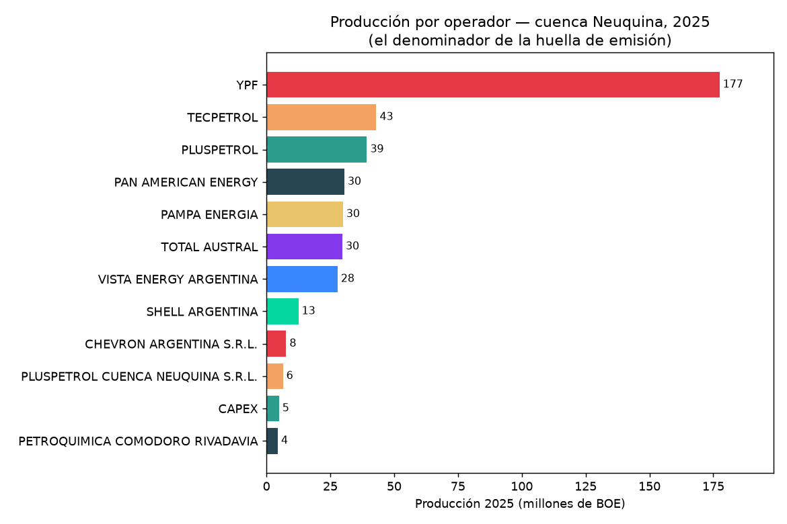

# Producción por operador (el denominador)

Toda "huella por barril" necesita un **denominador**: cuánto produjo cada operador. Acá está, real y
público — el cimiento sobre el que la [Fase 2](proximos-pasos.md) montará las emisiones.

Datos: producción **2025** (año calendario completo) de la cuenca Neuquina, de la Secretaría de Energía
argentina (dataset "Capítulo IV", por pozo/área/empresa), agregada por operador y convertida a **BOE**
(ver [Metodología](metodologia.md)).

## Ranking de operadores

{ loading=lazy }

Total de la cuenca 2025: **~37.000 Mm³ de gas** (~101 Mm³/día) y **~34,4 millones de m³ de petróleo**
(~592.000 bbl/día) → **~434 millones de BOE**. La concentración es alta: **YPF solo explica el ~41 %**.

| Operador | Gas (Mm³) | Petróleo (Mm³) | BOE (millones) | % cuenca | Perfil |
|---|---:|---:|---:|---:|---|
| YPF | 10.917 | 18,0 | 177 | 40,9 % | mixto |
| Tecpetrol | 6.217 | 1,0 | 43 | 9,9 % | gasífero |
| Pluspetrol | 3.957 | 2,6 | 39 | 9,1 % | mixto |
| Pan American Energy | 3.286 | 1,8 | 30 | 7,0 % | mixto |
| Pampa Energía | 4.491 | 0,6 | 30 | 6,9 % | gasífero |
| Total Austral | 4.726 | 0,3 | 30 | 6,8 % | gasífero |
| Vista Energy | 461 | 4,0 | 28 | 6,4 % | petrolero |
| Shell Argentina | 259 | 1,7 | 13 | 2,9 % | petrolero |

!!! tip "Por qué importa el perfil gas vs petróleo"
    Las emisiones no se reparten igual: el **flaring** y las **fugas de metano** pesan más en los
    operadores **gasíferos** (Tecpetrol, Total, Pampa), mientras que la huella de los **petroleros**
    (Vista, Shell) depende más del gas asociado que se quema o ventea. Por eso el numerador (Fase 2)
    hay que mirarlo **junto a este perfil**, no en abstracto.

## Mapa de operadores

Cada concesión, coloreada por su operador (los 8 principales en color, el resto en gris). Es la **base
geográfica de atribución**: en la Fase 2, cada antorcha o pluma detectada cae en una de estas
concesiones y se asigna a su operador.

<iframe src="../assets/mapa_operadores.html" width="100%" height="560" style="border:1px solid #ccc;border-radius:6px"></iframe>

*Pasá el mouse por una concesión para ver operador y producción 2025. Fuente de las concesiones: mapa
de la cuenca Neuquina (proyecto estado-del-sistema).*

> Reproducible: `python docs/pipeline/produccion_operador.py` y `produccion_visuals.py`. La tabla sale
> de `docs/data/produccion_por_operador.csv`.
